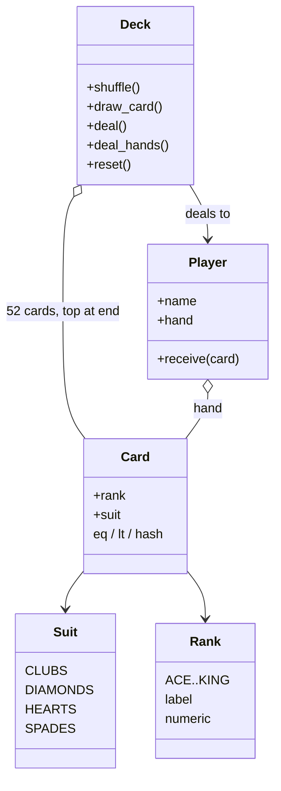

# Deck of 52 Cards

An object-oriented deck that builds 52 unique cards, shuffles them with Fisher-Yates, and deals fairly around a table.

`Suit` and `Rank` are closed enums. `Card` is an immutable pair of those enums. `Deck` owns a list of 52 unique cards. The top of the deck is the end of the list, so a draw is O(1). Shuffle is in-place Fisher-Yates: for `i` from `n - 1` down to `1`, swap `i` with a uniformly chosen `j` in `0..i`. That produces each of the 52! permutations with equal probability. `deal_hands` walks the table round-robin, so every player gets the same count and any leftover clump is spread evenly.

`random.shuffle` is Fisher-Yates underneath. This deck implements the algorithm itself so the uniformity and the off-by-one bound are visible in the code.

## Run

```bash
python3 cards_main.py
```

The console is only input and output. Domain rules stay in the `cards` package.

```
  1. New unshuffled deck
  2. Shuffle (Fisher-Yates)
  3. Deal N cards to each player
  4. Deal all remaining cards fairly
  5. Show remaining cards
  6. Show player hands
  7. Demo: shuffle and deal 5-card hands
  0. Exit
```

Option 7 builds a fresh deck, shuffles it, and deals 5 cards each to Alice, Bob, and Carol.

## Requirements

### Functional

- A standard 52-card deck: 13 ranks × 4 suits. No jokers unless they are added later.
- Shuffle so every permutation is equally likely.
- Draw or deal one or more cards from the top.
- Deal N cards to P players fairly.
- Reset the deck to a full unshuffled pack.
- Show remaining cards and player hands.

### Non-functional

- Construction and shuffle produce no duplicate cards.
- The shuffle is unbiased. Swapping every index with `rand(n)` is not uniform.
- `Deck` mutates the pack. `Card` does not change.
- An over-deal raises `EmptyDeckError`. It does not return `None` or wrap around.
- Draw is O(1), shuffle is O(n), and extra memory is O(1).

### Assumptions

- Ace is low for display sort (`numeric` 1). Blackjack or poker can treat Ace as high with a different sort key.
- No jokers, no multiple decks, and no cut card until those are added.
- Players only receive cards from the deck.
- A fair deal means an equal count, not equal hand strength.

## Classes



Composition, not inheritance. A deck has cards. A card has a suit and a rank. There is no `RedCard` subclass.

| Module | Responsibility |
|---|---|
| `cards/suit.py` | Four suits, each with a label and a print symbol |
| `cards/rank.py` | Thirteen ranks. `numeric` is sort strength. `value` is reserved by `Enum` |
| `cards/card.py` | Immutable value object. Comparable and hashable |
| `cards/deck.py` | The 52-card pack: shuffle, draw, deal, reset |
| `cards/player.py` | A named hand. Receives cards and does not draw from the deck |
| `cards_main.py` | Console only |

### Suit and Rank

The set is closed. A fifth suit cannot be constructed. Each suit carries a label and a symbol (`♣ ♦ ♥ ♠`), ordered Clubs, Diamonds, Hearts, Spades. Each rank carries a label and a `numeric` order from Ace (1) through King (13).

`numeric` is named that way because `Enum` already owns `.value`, which here is the raw `(label, numeric)` tuple.

### Card

A card is a value object. Identity is the pair `(rank, suit)`. After construction it does not change: `__slots__` holds `_rank` and `_suit`, and properties expose them. Cards can go in a set to prove uniqueness, and a hand can be sorted without mutating the card.

`@total_ordering` fills in `>`, `<=`, and `>=` from `__eq__` and `__lt__`. Order is rank first, then suit name.

### Deck

`Deck` is the only type that reorders or removes cards from the pack. Index 0 is the bottom. The last index is the top. Construction is the Cartesian product of every suit and every rank: 4 × 13 = 52, unique by construction. `reset` rebuilds that same pack.

### Player

A player is separate from the deck so a deal is not "return a list of lists." `hand` returns a copy, so a caller cannot mutate the real hand. `receive` is the only write path. The deck talks to the player, not to `player._hand`.

## Data structures

| Structure | Why |
|---|---|
| `list` of `Card` | Ordered pack. O(1) pop from the end |
| `set` of `Card` | Proves 52 unique hashes, because `Card` defines `__hash__` |
| `Enum` | Closed vocabulary. Iteration follows declaration order |

A `deque` can also pop in O(1). A list with the top at the end is enough, and Fisher-Yates needs random access, which a list already has. A linked list would make that shuffle O(n²).

An infinite shoe (blackjack) is a factory that resets and shuffles a new 52-card block, or several decks in one list (6 × 52) shuffled once. The `Card` type stays the same.

## Fisher-Yates shuffle

```python
def shuffle(self) -> None:
    cards = self._cards
    for i in range(len(cards) - 1, 0, -1):
        j = secrets.randbelow(i + 1)  # uniform in 0..i inclusive
        cards[i], cards[j] = cards[j], cards[i]
```

At step `i`, the card that lands at position `i` is chosen uniformly from the cards not yet finalized (indices `0..i`). By induction, every permutation has probability `1/n!`.

The biased version is `for i in 0..n-1: swap(i, randrange(n))`. Each step has `n` choices, so that generates `n^n` outcomes mapped onto `n!` permutations. `n^n` is not divisible by `n!` for `n > 2`, so some orders are more likely. For `n = 3`, 27 outcomes cannot split evenly across 6 permutations.

`randbelow(i)` is the off-by-one. It excludes swapping an index with itself and skews the distribution. The upper bound must be inclusive: `randbelow(i + 1)`.

`secrets.randbelow` is a cryptographic generator, uniform over the range. That is the right source if the deck is used for gambling. For a board game, `random.Random` with an optional seed is easier to replay in tests. CPython's `random.shuffle` is the same algorithm.

| | Cost |
|---|---|
| Time | O(n) swaps, one pass. Say O(n), then note that n is 52 |
| Space | O(1) extra. In place |

## Dealing

**`draw_card` / `deal_one`.** Pop from the tail. An empty deck raises `EmptyDeckError`, so the UI can tell "bad N" from "deck dry."

**`deal(n)`.** Take the last `n` cards, delete them, and reverse so the first returned card is the old top. That matches `n` calls to `deal_one`.

**`deal_hands(players, cards_per_hand)`.** For each of N cards, walk every player once. That is the casino and home-game convention. Giving one player all N cards, then the next, is a faster slice, and a residual clump would land in one hand. Random assignment is more code for the same fairness once the shuffle is already unbiased.

The method checks `players * N <= remaining` before it touches any hand. The deal is all-or-nothing.

**`deal_all`.** Keep dealing round-robin until the deck is empty. Leftover cards go to the earlier seats. Hand sizes differ by at most 1.

## OOP

**Encapsulation.** `Deck._cards`, `Card._rank` / `_suit`, and `Player._hand` are private. `Player.hand` returns a copy.

**Abstraction.** The console asks the deck to shuffle and deal. It does not build every `Card(rank, suit)` itself, and it does not see the Fisher-Yates loop.

**Composition over inheritance.** A card has a suit and a rank. A deck has a list of cards. Suits are not subclasses. This domain does not need an inheritance hierarchy.

**Immutability.** A card never changes identity. Only the deck's order and the player's hand change, so one card cannot sit in two hands and later change suit.

## SOLID

| Principle | In this design |
|---|---|
| Single responsibility | `Suit` and `Rank` are vocabulary. `Card` is identity and comparison. `Deck` is build, shuffle, draw, and reset. `Player` holds a hand and does not know Fisher-Yates. `cards_main.py` is the menu. Poker scoring would be a new module. |
| Open/closed | A joker is a new rank or card type, and `Deck` optionally includes it. Shuffle and deal stay as they are. A hand evaluator reads `rank` and `suit` and does not modify `Deck`. |
| Liskov substitution | There is no card subclass hierarchy. A later `Joker` would still need to hash and compare, including a card with no suit, without breaking a set of cards. |
| Interface segregation | The public surface is `shuffle`, `draw_card`, `deal_hands`, and `reset`. `peek` is display only. A player is not asked to shuffle. |
| Dependency inversion | `cards_main` calls deck methods, not the list layout. `Deck` depends on `Card`, not on the console. Tests can pass a short iterable into `Deck([...])`. |

Ace-high versus Ace-low is fixed in `Card.__lt__`. A comparator passed into `sorted` is the extension if several games need different order.

## Patterns

| Pattern | Where |
|---|---|
| Value object | `Card`: equality by value, hashable, immutable |
| Aggregate / facade | `Deck` is the only entry for pack operations. The UI does not touch the raw list |
| Factory | `Deck.__init__` and `reset` build the 52-card pack |
| Iterator | `__iter__`, `__len__`, and `__bool__` make the deck a collection |
| Decorator | `@total_ordering` fills in the missing comparisons |

An empty draw raises `EmptyDeckError` instead of returning a dummy card.

Not used: a singleton deck (hostile to tests), an observer (no UI subscribers in the domain), and a shuffle strategy (there is one correct algorithm).

## Complexity

| Operation | Cost |
|---|---|
| Build / reset | O(n). For a standard deck, n is 52 |
| `shuffle` | O(n) time, O(1) extra space |
| `draw_card` | O(1) |
| `deal(k)` | O(k) |
| `deal_hands(P, N)` | O(P × N) draws, plus an O(1) capacity check |
| Sorted hand | O(h log h) using `Card.__lt__` |

## Extensions

- **Shoe.** Build `6 × 52` cards and shuffle once. Track depletion and a reshuffle threshold (cut card).
- **Replay tests.** Accept an `rng` argument on `shuffle`.
- **Ace high.** Pass `key=` to `sorted`, or inject a comparator.
- **Threads.** One deck per table needs no lock. Two tables sharing a shoe need a lock around shuffle and deal. List pop is not atomic across check-and-pop.
- **Persistence.** Store remaining cards as `(rank, suit)` pairs. `Card` is already a value object.
- **Another client.** A web API calls the same `Deck` methods. `cards_main` is one client.
- **Discard pile.** A second list, or a `DiscardPile`. Shuffling the discard back in is a new method, not a change to `Card`.

## Design choices

**`random.shuffle` is the same algorithm.** Implementing Fisher-Yates here makes the uniform bound visible. Production game code can call the standard library and name the algorithm in a comment.

**Testing a shuffle.** Assert the same multiset, length 52, and no duplicates. Over many trials, the chance a given card is on top is about 1/52. Do not assert one specific order after a shuffle.

**Security follows the random source.** The algorithm is unbiased when each index is uniform. `secrets.randbelow` fits gambling. `random` fits solitaire.

**Round-robin is social fairness.** If the shuffle is unbiased, the first card is as random as any other. Dealing around the table spreads clumps. It does not repair a biased generator.

**Two threads drawing at once** is not safe. Each table gets its own deck, or the draw path takes a lock.
